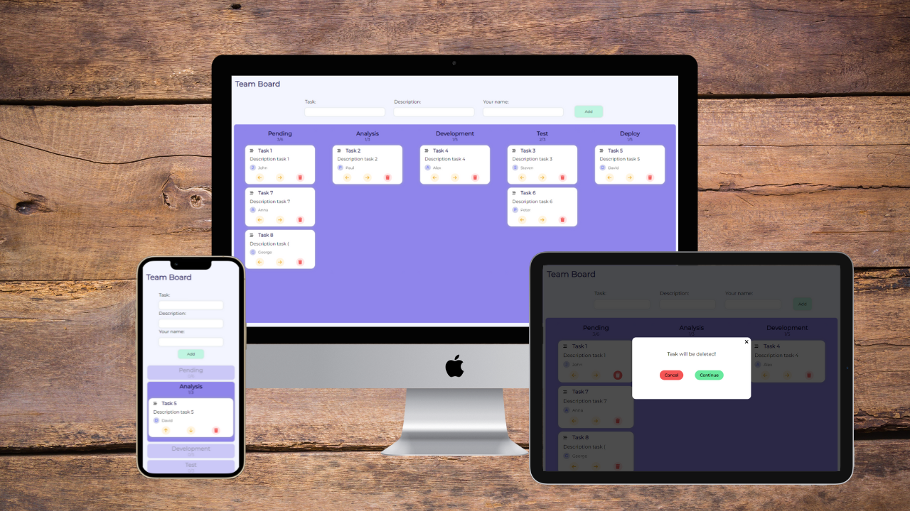

# Kanban Board App



&nbsp;

## :mag: Overview

:fire: Click to see live version: [Kanban Board App]()!

**Kanban Method** is a methodology for designing, improving and managing workflow. This method allows you to make evolutionary changes in your organization and increase productivity. You can find more information [here](https://kanbanblog.com/explained/).

**Kanban Board App** is used to visualize the process. 

### Features

- **Adding** tasks via a *validated* form
- **Moving** tasks between the columns
- **Deleting** tasks
- **Saving / deleting tasks using Local Storage**

&nbsp;

## :bulb: Technologies


&nbsp;

## :cd: Installation

### You can run the project locally 

- First you need to clone the project

``` 
git clone
```

- Then install all necessary packages

```
npm i
```
- Start developers mode

```
npm start
```

- App is ready to go:

  -  site
  ```
  http://localhost:3000/

&nbsp;

## :wave: Feel free to contact me

You can find me here:

- [LinkedIn](https://www.linkedin.com/in/jakub-parol/)
- [GitHub](https://github.com/kubaparol)

&nbsp;

## :clap: Special thanks

Special thanks to my [Mentor - devmentor.pl](https://devmentor.pl/) - for providing me with this task and for code review.